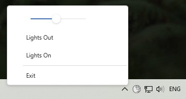

# LightsOut :new_moon:

## LightsOut allows you to programmatically reduce screen brightness.
Only for windows

- Supports multiple screens

- Taskbar icon 

## How it works
The application creates a transparent window on top of all windows to lower the brightness.

## Tools & libs
- C#
- .net 7
- WPF
- [HandyControl](https://github.com/HandyOrg/HandyControl) (UI wpf components)
- [Hardcodet.NotifyIcon](https://github.com/hardcodet/wpf-notifyicon) (wpf taskbar icon)
- [WpfScreenHelper](https://github.com/micdenny/WpfScreenHelper) 

### [Download](https://github.com/Gorddd/LightsOut/releases/tag/v1.0) :link: